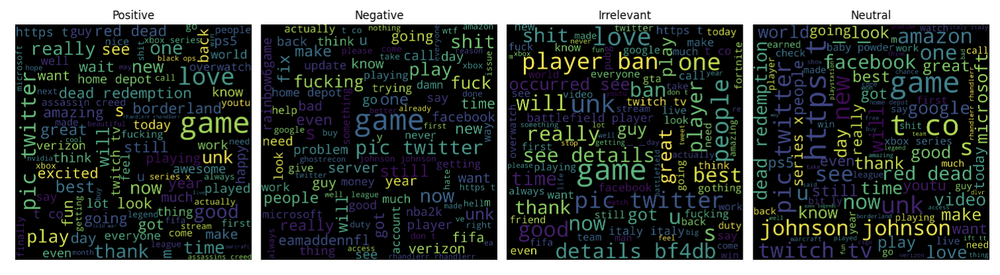

# Sentiment Analysis Research

This repository contains research on sentiment analysis, which is the automated process of determining and classifying opinions expressed in text. The research focuses on the use of machine learning algorithms to evaluate social media material in Hindi and English.

## Introduction

In the age of social media, sentiment analysis, a subfield of natural language processing (NLP) and machine learning, has become crucial for extracting valuable insights from user-generated content. It aims to computationally determine the emotional tone and subjective information in text, with applications ranging from business intelligence to political analysis. This research focuses on sentiment analysis, emphasizing multilingual datasets encompassing English and Hindi. Social media platforms have transformed communication, offering vast repositories of opinions and emotions. This research explores the challenges and applications of sentiment analysis in this dynamic landscape, particularly in multilingual contexts.

## Data Collection and Preprocessing

In this research project, data collection and preprocessing are fundamental steps in preparing datasets for sentiment analysis in both English and Hindi. Kaggle, a renowned platform for data science and machine learning, serves as our data source. We focus on datasets with associated sentiment labels (positive or negative). The key data collection steps involve exploring Kaggle's extensive dataset repository, selecting relevant datasets, and ensuring linguistic diversity by considering both English and Hindi data. These datasets provide ground truth sentiment labels for model training and evaluation.

Data preprocessing is essential to clean and prepare the text data for analysis. This involves several steps:

1. **Text Cleaning:** Raw text data is often noisy with elements like HTML tags, special characters, and URLs. Text cleaning techniques are applied to remove these artefacts and ensure the text's cleanliness.

2. **Tokenization:** Text is broken down into individual words or tokens, a fundamental step in converting text into analyzable units.

3. **Stopword Removal:** Common stopwords, which contribute minimal semantic value, are removed from the text to streamline the data and reduce dimensionality.

4. **Stemming and Lemmatization:** Variations of words, such as plurals or verb tenses, are normalized using stemming or lemmatization to treat similar words as the same feature.

Feature extraction techniques, such as TF-IDF vectorization and word embeddings like Word2Vec or GloVe, are employed to convert the text data into numerical vectors suitable for machine learning models. To address potential class imbalances in sentiment labels, we may use oversampling or undersampling techniques for dataset balancing. The datasets are split into training, validation, and testing subsets, allowing for model training, hyperparameter tuning, and performance evaluation. Lastly, sentiment labels are encoded into numerical values (e.g., 0 for negative and 1 for positive) to facilitate model training.

These data collection and preprocessing steps are crucial in preparing clean and structured datasets for the subsequent stages of sentiment analysis research.

## Feature Engineering

A significant part of this research is dedicated to feature engineering, a critical aspect of machine learning. The goal is to enable algorithms to better capture the nuances of sentiment in text data. The feature engineering process includes various steps:

1. **Text Normalization:** All text data is transformed to lowercase to ensure uniformity in processing.

2. **URL and Mention Removal:** URLs and mentions (e.g., "@username") are removed from the text as they often do not contribute to sentiment analysis.

3. **Whitespace Removal:** Extra whitespace, including multiple consecutive spaces, is replaced with a single space to improve text readability.

4. **Hashtag Handling:** Hashtags (e.g., "#topic") are simplified to a common character, '1', to retain their essence while removing the '#' symbol.

5. **Punctuation Removal:** Punctuation marks such as periods, colons, exclamation marks, question marks, hyphens, single and double quotation marks, and forward slashes are removed from the text.

6. **Stripping Quotes:** Leading and trailing single and double quotation marks are stripped from the text.

7. **Tokenization:** Tokenization breaks down text data into individual words or tokens. While English uses space-based tokenization, Hindi text, without spaces between words, requires specialized techniques.

8. **Stopword Removal:** Common and unnecessary words, known as stopwords, are removed from the text. Specific stopwords and their removal are not detailed.

9. **Removing Newlines:** Any newline characters ('\n') within the tokens are removed.

10. **Emoji Removal:** Emojis are removed from the text data.

The feature engineering process ensures that the text data is clean, uniform, and ready for analysis.

## Data Analysis and Visualizations

The sentiment analysis project initially employed the TextBlob library, a rule-based approach to sentiment analysis. However, TextBlob's performance was limited, particularly in handling the complexities and nuances of tweets.

To visualize word frequency distributions, the project utilized the wordcloud library in Python, creating visually appealing representations of word frequency. Word clouds were generated for both Hindi and English datasets, providing insights into prominent words and themes in the data.

To overcome limitations and enhance accuracy, advanced machine learning algorithms tailored for natural language processing were integrated. This aimed to achieve higher accuracy in sentiment classification by capturing intricate patterns and nuances in tweets that rule-based methods might miss. The integration of these machine learning algorithms also ensured robust handling of diverse and dynamic Twitter data, allowing the system to generalize effectively to unseen tweets.

This comprehensive feature engineering and analysis process forms the foundation of the sentiment analysis research, enabling a deeper understanding of sentiment in multilingual datasets.

## Machine Learning Models

The core of the research focuses on investigating two prominent machine learning models: Naive Bayes and Logistic Regression. These models are thoroughly explained, highlighting their mathematical foundations and inner workings. The Naive Bayes theorem, based on conditional probability, is elucidated to provide a comprehensive understanding of its application in sentiment analysis.

In my sentiment analysis research, we developed and evaluated machine learning models, including Naive Bayes and Logistic Regression, to classify social media text as positive or negative in both English and Hindi. The Naive Bayes model relies on Bayesian probability principles, using prior, likelihood, and posterior probabilities for classification. Conversely, Logistic Regression employs a logistic function to estimate the likelihood of text belonging to a sentiment class. We also explored N-grams for enhanced text representation. Both models underwent comprehensive pipelines, including data preprocessing, vectorization, training, hyperparameter tuning, and performance evaluation, to improve sentiment analysis accuracy for social media content.

## Experiments and Evaluation

The research design involved extensive experiments and evaluations to assess the performance of sentiment analysis algorithms across different languages and cultural contexts. Key metrics such as accuracy, sensitivity, specificity, and F1 score were used to comprehensively evaluate the models' effectiveness.

The sentiment analysis research utilized two machine learning models: Naive Bayes (NB) and Logistic Regression. The dataset was divided into training (85%) and testing (15%) sets. The MultinomialNB classifier was trained on the training data and evaluated on the testing data using confusion matrices and classification reports to measure performance.

Additionally, a Logistic Regression model was examined for sentiment analysis, trained with hyperparameters C=1 and the 'liblinear' solver, and evaluated primarily using accuracy. The Logistic Regression model outperformed the Naive Bayes model in all metrics.

To further enhance performance, an n-gram analysis was performed, considering up to 4-word n-grams. This approach improved the Logistic Regression model's test accuracy to 90.8%. Capturing multi-word phrases through n-grams proved beneficial for sentiment classification, enabling the model to understand nuanced expressions and context within the text.

The evaluation results, summarized in Table 2, demonstrate that the Logistic Regression model using 4-word n-grams achieved the highest accuracy and performance metrics, outperforming the Naive Bayes model across all evaluated measures.

## Keywords

- Human emotion analysis
- Machine learning
- Natural language processing
- Social media analysis
